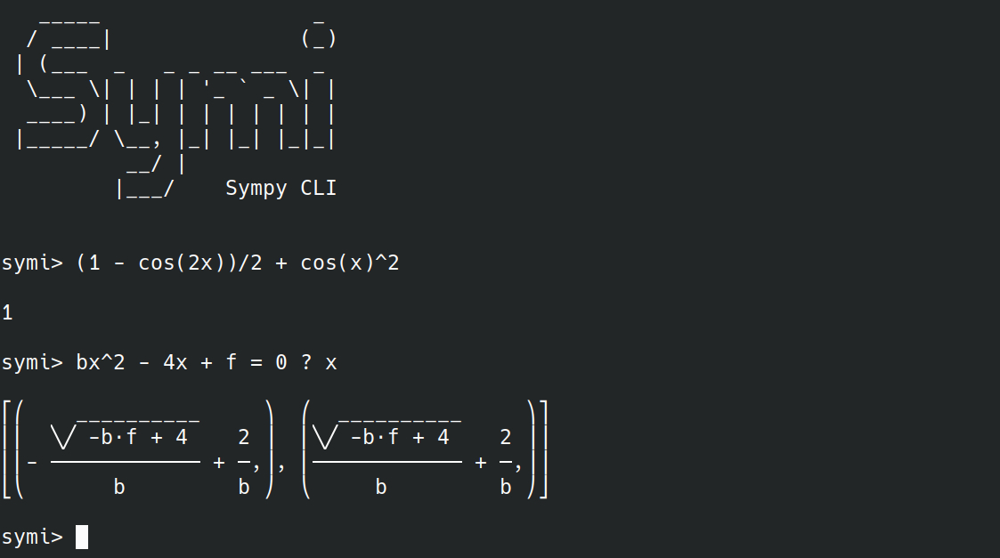

# Symi : Command-Line Interface for Symbolic Computation

Symi is a command-line interface to make symbolic computation easily. It runs
under Python and is based on [Sympy](https://www.sympy.org/en/index.html).



## Features

Symi supports all the SymPy functions and syntaxes. Here are some of the main
features :
- Variables do not need to be declared to be used
- Variable storing
- Implicit multiplications (you can disable it)
- Equation solver

## Installation

You need to [install Python](https://www.python.org/downloads/) to run Symi.
Once it is done, install SymPy and AnyTree:

```bash
pip install sympy
pip install anytree
```

You can now clone this repository anywhere you want to install Symi:
```bash
git clone https://github.com/Teskann/Symi
```

Then, move to the folder and run the program:
```bash
cd Symi
python ./cli.py
```

### Install on Linux

If you use a Linux-based OS, you can run the following command to install Symi
(after having cloned the repository and installed the Python dependencies):

```bash
$ python Symi/install_linux.py
```
This creates a `symi` alias for the command `python <location>/cli.py` and adds
it to your .bashrc. Then, source your bashrc:
```bash
$ source ~/.bashrc
```

You can now run Symi with

```bash
$ symi
```

You are ready to go !

## Documentation

### Save an expression

To save a variable, simply run:
```bash
symi> x = 2
```

You can of course save a symbolic expression:
```bash
symi> x = a+cos(t)
```

As variable names are stored as expressions, you can also do:
```bash
symi> x + y = 2a + h/2
```

### Display Saved variables

In these examples we will work with the following variables
```bash
symi> x = a+cos(t)
symy> r + t = tan(alpha_0)
```

To display all saved variables, simply type :
```bash
symi> vars

x = a + cos(t)
r + t = tan(alpha_0)

```
This will print all the saved expressions.

To view a specific expression, simply enter its name:
```bash
symi> x

a + cos(t)

symi> r + t

tan(α₀)

```

### Clear all variables

To clear all variables, simply run:

```bash
symi> clear
```

### Evaluate an expression

To evaluate an expression, simply enter it in the CLI:

```bash
symi> sin(x)^2 + cos(x)^2

1

```

If you saved a value and re-use it later in another expression, it won't be
substituted :

```bash
symi> x = 10
symi> sin(x)

sin(x)

```

To make the substitution using all the variables you declared, you can add a 
`!` at the end of the command:
```bash
symi> x = 10
symi> sin(x)!

sin(10)

```

To make a numeric simplification, just add `!!` at the end of the command line:
```bash
symi> x = 10
symi> sin(x)!!

-0.544021110890615

```

Note : The `!` or `!!` for substitution will only work at the end, otherwise it
will be interpreted as a factorial function.

If you want to substitute your variable at a specific place in the expression,
precede it by a `@`:

```bash
symi> x = y+1
symi> sin(@x) + x

x + sin(y + 1)

```

### Solve Equations

Symi comes with a straight forward equation solver, that works for non-linear
equations (using SymPy's `solve()` function)

To do so, write the equation(s) on the left, add a question mark `?` and then
write the unknowns.
If you write many equations, split them by a semicolon `;`, and if you have
many unknowns, split them with a semicolon too `;`. Here are some examples :

```bash
symi> cos(x) = 0 ? x

⎡⎛π ⎞  ⎛3⋅π ⎞⎤
⎢⎜─,⎟, ⎜───,⎟⎥
⎣⎝2 ⎠  ⎝ 2  ⎠⎦

symi> xy^2+1 = u ; xy-u_0 = b ? x; y

⎡⎛        2        ⎞⎤
⎢⎜(b + u₀)   u - 1 ⎟⎥
⎢⎜─────────, ──────⎟⎥
⎣⎝  u - 1    b + u₀⎠⎦


```

### Work with Physics constants

```bash
symi> import physics_constants


symi> c

299792458

symi> k

1.380649e-23

```

### Special functions

- `L(f)`, `Laplace(f)` : Laplace transform of `f` with respect to `t`
  with `s` as a 
Laplace variable:
  ```bash
  symi> L(sin(t))

     1   
   ──────
    2    
   s  + 1
    
  ```

### Integration

 Use the `$` to integrate functions of one variable :

  ```bash
  symi> $x
  
   2
  x 
  ──
  2
  
  symi> $arctan(x)

                 ⎛ 2    ⎞
              log⎝x  + 1⎠
  x⋅atan(x) - ───────────
                   2
  ```
  Note that the `$` operator has a lower priority than addition and subtraction:

  ```bash
  symi> $x + 1
  
  x⋅(x + 2)
  ─────────
      2
  ```

This won't work with multivariable functions. Instead use `integrate()` Sympy's
function (or `int()`) :
```bash
symi> integrate(cos(tx), x)

⎧sin(t⋅x)           
⎪────────  for t ≠ 0
⎨   t               
⎪                   
⎩   x      otherwise

symi> int(1/2*gt^2, t)
   3
g⋅t 
────
 6
```

### Limits

Symi offers a syntax to compute limits:

```bash
symi> lim x->0 ? sin(x)/x

1

symi> lim 2xy+z -> ab- ? (z+2yx-ba)^-1

-∞
```

### Change Options

If you want to disable implicit multiplication, run
```bash
symi> implicit_multiplication off
```

If you work with numeric approximations, you can change the tolerance level,
which defaults to `1e-10`:
```bash
symi> num_tolerance 1e-3
```