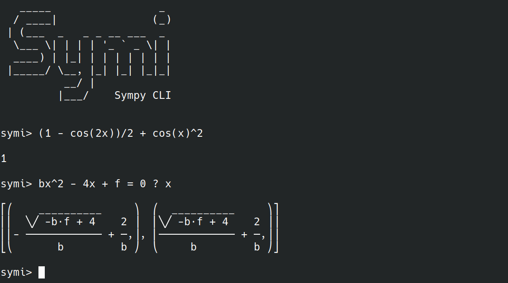

# Symi : Command-Line Interface for Symbolic Computation

Symi is a command-line interface to make symbolic computation easily. It runs
under Python and is based on [Sympy](https://www.sympy.org/en/index.html).



[](mdtoc)
## Table of Contents

* [Features](#features)
* [Get Started](#get-started)
	* [Prerequisites](#prerequisites)
	* [Installation](#installation)
	* [Run it](#run-it)
* [Documentation](#documentation)
	* [Save an expression](#save-an-expression)
	* [Display Saved variables](#display-saved-variables)
	* [Clear all variables](#clear-all-variables)
	* [Evaluate an expression](#evaluate-an-expression)
	* [Rewrite an expression](#rewrite-an-expression)
	* [Solve Equations](#solve-equations)
	* [Work with Physics constants](#work-with-physics-constants)
	* [Special functions](#special-functions)
	* [Differentiation](#differentiation)
	* [Integration](#integration)
	* [Limits](#limits)
	* [Change Options](#change-options)
		* [Display Options](#display-options)
		* [Implicit Multiplication](#implicit-multiplication)
		* [Numeric Tolerance](#numeric-tolerance)
		* [Use τ instead of 2π !](#use--instead-of-2-)
		* [Always Apply substitution](#always-apply-substitution)
		* [Always Apply Numerical Evaluation](#always-apply-numerical-evaluation)
		* [Differentiation Variable](#differentiation-variable)
		* [Integration Variable](#integration-variable)
[](/mdtoc)

## Features

Symi supports [all the SymPy functions and syntaxes](https://docs.sympy.org/latest/modules/index.html).
Here are some of the main features :
- :heavy_checkmark: Variables do not need to be declared to be used
- :heavy_checkmark: Variable storing
- :heavy_checkmark: Implicit multiplications (you can disable it)
- :heavy_checkmark: Equation solver
- :heavy_checkmark: Unix pipeline syntax supported

> :warning: *This project does not contain automated tests yet. It may happen
> that some computations return a wrong result.*

## Get Started

### Prerequisites

- You need to [install Python 3.8+](https://www.python.org/downloads/) to run Symi.
:snake:
- If you are under Windows, you also need to [download make](https://stackoverflow.com/questions/32127524/how-to-install-and-use-make-in-windows).
:hammer:

### Installation

Run in a shell:

```shell
git clone https://github.com/Teskann/Symi && cd Symi && make
```

### Run it

```commandline
symi
```

You're done ! :tada:

## Documentation

### Save an expression

To save a variable, simply run:
```bash
symi> x = 2
```

You can of course save a symbolic expression:
```bash
symi> x = a+cos(t)
```

As variable names are stored as expressions, you can also do:
```bash
symi> x + y = 2a + h/2
```

### Display Saved variables

In these examples we will work with the following variables
```bash
symi> x = a+cos(t)
symy> r + t = tan(alpha_0)
```

To display all saved variables, simply type :
```bash
symi> vars

x = a + cos(t)
r + t = tan(alpha_0)

```
This will print all the saved expressions.

To view a specific expression, simply enter its name:
```bash
symi> x

a + cos(t)

symi> r + t

tan(α₀)

```

### Clear all variables

To clear all variables, simply run:

```bash
symi> clear
```

### Evaluate an expression

To evaluate an expression, simply enter it in the CLI:

```bash
symi> sin(x)^2 + cos(x)^2

1

```

If you saved a value and re-use it later in another expression, it won't be
substituted :

```bash
symi> x = 10
symi> sin(x)

sin(x)

```

To make the substitution using all the variables you declared, you can add a 
`!` at the end of the command:
```bash
symi> x = 10

symi> sin(x)!
sin(10)

```

To make a numeric simplification, just add `!!` at the end of the command line:
```bash
symi> x = 10

symi> sin(x)!!
-0.544021110890615

```

Note : The `!` or `!!` only work at the end of the command line.

If you want to substitute your variable at a specific place in the expression,
precede it by a `@`:

```bash
symi> x = y+1

symi> sin(@x) + x
x + sin(y + 1)

```

To automatically apply substitution, see `always_sub` option below.

### Rewrite an expression

By default, all the results displayed in Symi are simplified with [Sympy's simplify function](https://docs.sympy.org/latest/tutorial/simplification.html#simplify).
However, in some cases you might want to display your expression another way
(partial fraction decomposition, expanded expression, ...).
To rewrite an expression, you can use all the [Sympy functions for simplification](https://docs.sympy.org/latest/tutorial/simplification.html).
Symi comes with a support of Unix pipelines syntaxes to make this easier.

For example, to expand an expression, you can run

```bash
symi> (a+b)^2 | expand

 2            2
a  + 2⋅a⋅b + b
```
This is equivalent to :
```bash
symi> expand((a+b)^2)

 2            2
a  + 2⋅a⋅b + b
```

Another example, for factorization:
```bash
symi> a^3+3a^2b+3ab^2+b^3 | factor

       3
(a + b)
```

Partial fraction decomposition :
```bash
symi> 1/((x+3)*(x+1)) | apart

      1           1    
- ───────── + ─────────
  2⋅(x + 3)   2⋅(x + 1)
```

*Note : Instead of using `apart`, you can use `des` which is an equivalent that
stands for "**D**écomposition en **É**léments **S**imples" ("partial fraction decomposition" in French)*.

### Solve Equations

Symi comes with a straight forward equation solver, that works for non-linear
equations (using SymPy's `solve()` function).

To do so, write the equation(s) on the left, add a question mark `?` and then
write the unknowns.
If you write many equations, split them by a semicolon `;`, and if you have
many unknowns, split them with a semicolon too `;`. Here are some examples :

```bash
symi> cos(x) = 0 ? x

⎡⎛π ⎞  ⎛3⋅π ⎞⎤
⎢⎜─,⎟, ⎜───,⎟⎥
⎣⎝2 ⎠  ⎝ 2  ⎠⎦

symi> xy^2+1 = u ; xy-u_0 = b ? x; y

⎡⎛        2        ⎞⎤
⎢⎜(b + u₀)   u - 1 ⎟⎥
⎢⎜─────────, ──────⎟⎥
⎣⎝  u - 1    b + u₀⎠⎦


```

### Work with Physics constants

```bash
symi> import physics_constants


symi> c
299792458

symi> k
1.380649e-23

```

### Special functions

- `L(f)`, `Laplace(f)` : Laplace transform of `f` with respect to `t`
  with `s` as a 
Laplace variable:
  ```bash
  symi> L(sin(t))

     1   
   ──────
    2    
   s  + 1
    
  ```
- `Linv(f)`: Inverse Laplace transform of `f` with respect to `s` with `t` as
the time variable:
  ```bash
  symi> Linv(s/(s^2+1))
  cos(t)⋅θ(t)

  symi> F = 1/s^2

  symi> Linv(@F)
  t⋅θ(t)
  ```

### Differentiation

Use the single quote `'` to differentiate a function.
```bash
symi> x^2'
2⋅x

symi> cos(x) + 2x'
2 - sin(x)
```

For functions with more than one variable, you need to set `diff_variable` parameter:

```bash
symi> diff_variable t

symi> cos(omega*t+phi)'
-ω⋅sin(ω⋅t + φ)
```

### Integration

 Use the `$` to integrate functions of one variable :

  ```bash
  symi> $x
  
   2
  x 
  ──
  2
  
  symi> $arctan(x)

                 ⎛ 2    ⎞
              log⎝x  + 1⎠
  x⋅atan(x) - ───────────
                   2
  ```
  Note that the `$` operator has a lower priority than addition and subtraction:

  ```bash
  symi> $x + 1
  
  x⋅(x + 2)
  ─────────
      2
  ```
To make it work with multivariable functions, update the `integration_variable` option:

```bash
symi> integration_variable t


symi> $gt

   2
g⋅t 
────
 2

symi> $x^2

   2
t⋅x
```

You can also use `integrate()` Sympy's
function (or `int()`) :
```bash
symi> integrate(cos(tx), x)

⎧sin(t⋅x)           
⎪────────  for t ≠ 0
⎨   t               
⎪                   
⎩   x      otherwise

symi> int(1/2*gt^2, t)
   3
g⋅t 
────
 6
```

### Limits

Symi offers a syntax to compute limits:

```bash
symi> lim x->0 ? sin(x)/x
1

symi> lim 2xy+z -> ab- ? (z+2yx-ba)^-1
-∞
```

### Change Options

#### Display Options
To display the current status of the options, run:
```bash
symi> options

implicit_multiplication : True
num_tolerance : 1e-10
tau_kills_pi : False
```

#### Implicit Multiplication

If you want to disable implicit multiplication, run
```bash
symi> implicit_multiplication off
```

#### Numeric Tolerance

If you work with numeric approximations, you can change the tolerance level,
which defaults to `1e-10`:
```bash
symi> num_tolerance 1e-3
```

#### Use τ instead of 2π !

If you think mankind should use τ=2π as the circle constant, you can enable the
option `tau_kills_pi`:
```bash
symi> tau_kills_pi

symi> pi

τ
─
2

symi> cos(tau)
1

symi> tau_kills_pi off

symi> pi
π
```

#### Always Apply substitution

If you are tired of using the `@` and `!` operators and you want
to always apply variable substitutions, you can enable `always_sub`
option.

```bash
symi> f=x^2 + 2x + 1

symi> diff(f)
1

symi> always_sub

symi> diff(f)
2⋅x + 2
```

#### Always Apply Numerical Evaluation

There is also an option to always apply numerical evaluation:

```bash
symi> cos(pi/4)

√2
──
2

symi> always_num

symi> cos(pi/4)
0.707106781186548
```

#### Differentiation Variable

If you differentiate a function of one variable with `'`, the differentiation
variable is detected automatically. However, on multivariable functions, you
need to set the `diff_variable` option:

```bash
symi> diff_variable x

symi> ax^2'
2⋅a⋅x
```

#### Integration Variable

If you integrate with `$` on a function of one variable, this variable is used
as the integration variable. However if you integrate multivariable functions,
you need to set `integration_variable` option:

```bash
symi> integration_variable x

symi> $cos(ax)

⎧sin(a⋅x)           
⎪────────  for a ≠ 0
⎨   a               
⎪                   
⎩   x      otherwise
```

This works also for multiple dimensions integration:

```bash
symi> integration_variable xy

symi> $x^2-y

   ⎛ 2    ⎞
x⋅y⋅⎝x  - y⎠

```